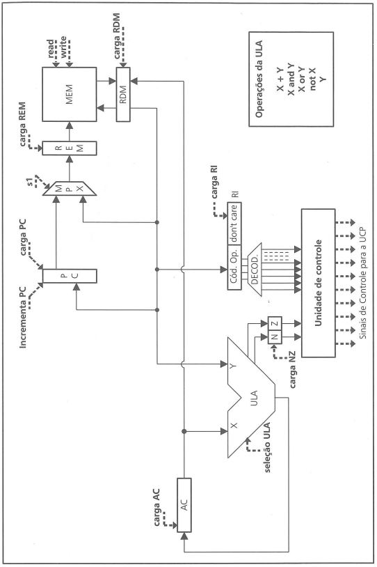
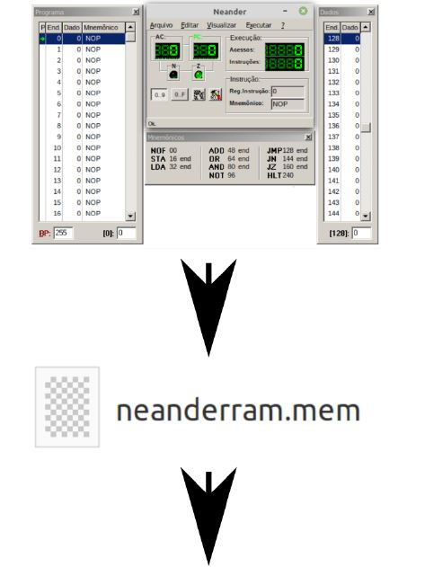
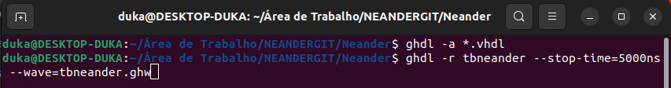
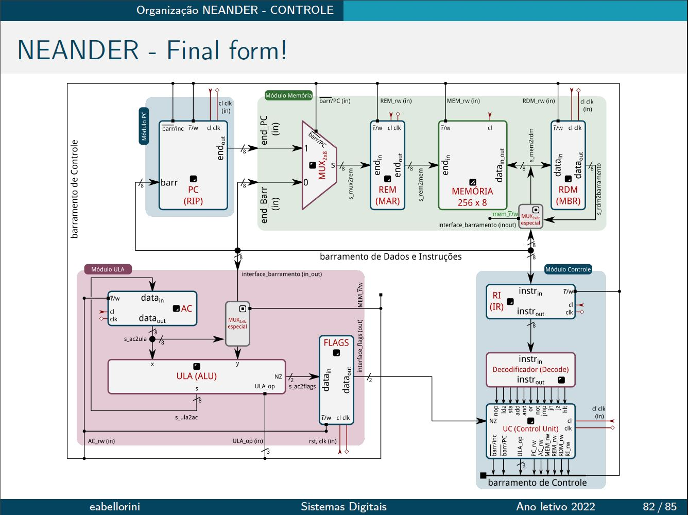

# Neander Computador Teorico
O computador hipotético *Neander* foi criado com intenções didáticas para permitir exercitar os conceitos básicos da arquitetura de Von Neumann. Ele foi inspirado no computador IAS, projetado por John Von Neumann, e visa facilitar ao aprendizado da programação em linguagem binária. Embora com dimensões reduzidas e muito primitivo para uso prático, ele é tão simples que você, sem muito esforço. pode programá-lo e projetá-lo.

**Características:**
- Largura de dados e endereços de 8 bits
- Dados representados em complemento de dois
- Um acumulador de 8 bits (AC)
- Um apontador de programa de 8 bits (PC)
- Um registrador de estado com 2 códigos de condição: negativo (N) e zero (Z)

**Conjunto de instruções e ações executadas:**

O conjunto de instruções do *Neander* compreende 11 instruções, codificadas por meio dos quatro bits mais significativos da palavra que contém o código da instrução.
| Código  | Instrução | Comentário |
| :---: | --- | --- |
| 0000  | NOP  | nenhuma operação |
| 0001  | STA end | armazena acumulador - (store) |
| 0010  | LDA end | carrega acumulador - (load)  |
| 0011  | ADD end | soma |
| 0100  | OR end  | "ou" lógico  |
| 0101  | AND end  | "e" lógico  |
| 0110  | NOT  | inverte (complementa) acumulador  |
| 1000  | JMP end | desvio incondicional - (jump)  |
| 1001  | JN end  | desvio condicional - (jump on negative) |
| 1010  | JZ end  | desvio condicional - (jump on zero)  |
| 1111  | HLT  | término de execução - (halt) |

Na Tabela acima, *end* significa endereço direto. Nas instruções STA, LDA, ADD, OR e AND, *end* corresponde ao endereço de operando. Nas instruções JMP, JN e JZ, *end* corresponde ao endereço de desvio. As ações efetuadas pelas instruções da tabela acima são apresentadas na tabela abaixo:

| Instrução | Comentário |
| --- | --- |
| NOP     | nenhuma operação |
| STA end | MEM(end) ← AC |
| LDA end | AC ← MEM(end)  |
| ADD end | AC ← MEM(end) + AC |
| OR end  | AC ← MEM(end) OR AC |
| AND end | AC ← MEM(end) AND AC |
| NOT     | AC ← NOT AC |
| JMP end | PC ← end |
| JN end  | IF N=1 THEN PC ← end |
| JZ end  | IF Z=1 THEN PC ← end |

Na Tabela acima, AC é o acumulador, MEM(end) significa conteúdo da posição *end* de memória, N e Z são os códigos de condição e ← representa uma atribuição.
# Organização do Neander
Para definir uma organização para o computador *Neander*, é preciso inicialmente definir os elementos necessários. Esses dados podem ser retirados das próprias características do *Neander*:
- Largura de dados e endereços de 8 bits
- Dados representados em complemento de dois
- Um acumulador de 8 bits (AQ)
- Um apontador de programa de 8 bits (PC)
- Um registrador de estado com 2 códigos de condição: negativo (N) e zero (Z)

Assim, os seguintes elementos são necessários:
- Um registrador de 8 bits para o acumulador
- Um registrador de 8 bits para o PC (e, possivelmente, um registrador contador)
- Dois *flip-flops*: um para o código de condição N e outro para Z
- Uma memória de 256 posições de 8 bits cada

**Considerações:**
1. O incremento do PC poderia ser feito de várias maneiras. Entre elas, são citadas a soma feita por meio da ULA, a soma feita por meio de um somador próprio e o uso de um registrador contador. Para a organização optou-se por esta última.
2. Para cada registrador é necessário um sinal de “carga” correspondente, que indica quando o valor da sua entrada deve ser armazenado.
3. Para atualizar os códigos de N e Z durante a operação de LDA, acrescentou-se uma operação de transferência por meio da ULA. Com isso, a ULA realiza cinco operações possíveis.
4. As entradas X e Y da ULA, assim como as operações de NOT(X) e Y foram escolhidas a fim de simplificar as transferências. Com isso, a entrada X está permanentemente ligada à saída do acumulador AC, e a entrada Y da ULA está ligada ao RDM.
5. O único registrador que recebe dados de duas fontes possíveis é o REM. Para solucionar este conflito, utiliza-se um multiplexador que seleciona entre o PC (sel=0) e o RDM (sel=1).

# Como testar

Na pasta simulador contém o executável do *"Wneander"*, deve-se criar um programa lógico para o que você deseja fazer, salvar o arquivo *.mem* antes de executar e jogar na pasta do *Neander* abrir o terminal dentro da pasta via *Linux* (ou outro ambiente de teste que você possa utilizar) e executar os seguintes passos:

Na imagem acima o primeiro comando análisa todos os arquivos contidos na pasta, o segundo cria um arquivo de onda baseado no nome do seu tb (testbench) do *Neander* e o tempo fica dependente do que você implentou no *"Wneander"*. Para executar esses comandos e abrir o arquivo de onda basta colocar este comando no seu terminal para baixar o necessário:
`sudo apt-get install ghdl gtkwave geany`

Fonte: WEBBER, Raul Fernando, Fundamentos de Arquitetura de Computadores. Porto Alegre, Bokman, 4ª Edição. 2012.

**Imagem utilizada de base para o Neander feito:**

## Contribuidores

`Projeto Final do ano letivo de 2022 da matéria de Sistemas digitais ministrada pelo professor Edmar Bellorini e desenvolvida pelos alunos Eduardo Cozer, Geandro Silva e Vinicius Messaggi na Instituição de ensino superior UNIOESTE (Universidade Estadual do Oeste do Paraná)`

<table>
  <tr>
    <td align="center"><a href="https://github.com/Eduardo-Cozer"> <b>Eduardo Cozer</b></a> </td>
    <td align="center"><a href="https://github.com/GeandroRdS"> <b>Geandro Silva</b></a> </td>
    <td align="center"><a href="https://github.com/Vmessaggi"> <b>Vinicius Messaggi</b></a> </td>
  </tr>
</table>
